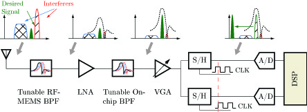

In contrast to a low-pass sampling receiver, the bandpass sampling receiver samples at a much lower frequency with respect to the center frequency of the signal. The analog-to-digital converter (ADC) in the band-pass sampling radio therefore operates at a much lower bandwidth, resulting in a significant reduction in power consumption. The I/Q separation and baseband processing (channel filtering, base-band AGC, etc) can be carried out entirely in the digital domain. This will improve flexibility in terms of adapting to different waveforms and wireless standards. Compared with existing solutions, the tunable bandpass sampling architecture pushes digitization as close to the antenna as possible without having to sacrifice the dynamic range and has the potential to significantly increase the utilization of the ever more crowded radio frequency spectrum.
