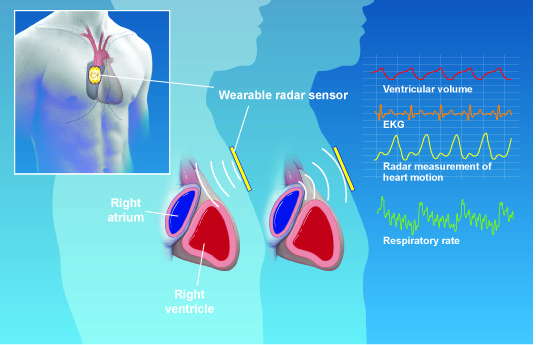

The DART lab has been working with industry partners to apply our expertise in high frequency electronics to medical applications. One example is the use of ultra-low-power radar sensors for the detection of heart health conditions. Contrary to many existing work on radar-based stand-off detection of vital signs, our solution relies on contact-based measurement which significantly reduces the power consumption, increases the accuracy, and improves noise/clutter rejection.

