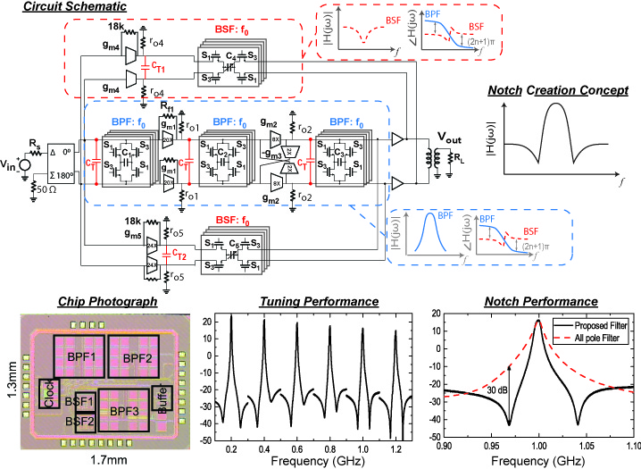

Although passive filters, such as surface acoustic wave (SAW) filters, film bulk acoustic resonator filters, and the evanescent-mode tunable filters mentioned above, offer excellent filtering performances in terms of rejection, passband flatness, and linearity, their relatively large physical size prevents them from being integrated with the active circuits. In recent years, N-path filters have regained interest because of its potential in providing very high filter shape factors within integrated circuit processes. The most unique characteristics for N-path filters is that their center frequency is determined by the clock frequency, therefore allowing for extremely wide tuning range often approaching 10:1.

Using an N-path resonator as a building block, we have been investigating advanced tunable on-chip RF filter designs. In several recent works, we have proposed and demonstrated the capability of creating very notch frequencies very close to the filter passband. This is achieved by the parallel combination of one N-path bandpass filter and one N-path bandstop filter. The interferometric cancellation of the signals traveling through the two paths results in sharp rejection bands. In the actual design implemented in a 65-nm CMOS process, the parasitic capacitances lead to less attenuation in the notch bands, which can be compensated by introducing tuning elements (switches) in the baseband capacitors and by adding an additional signal cancellation path.
